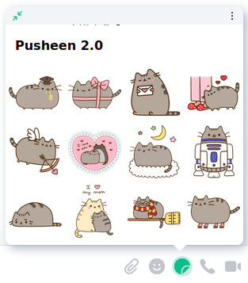
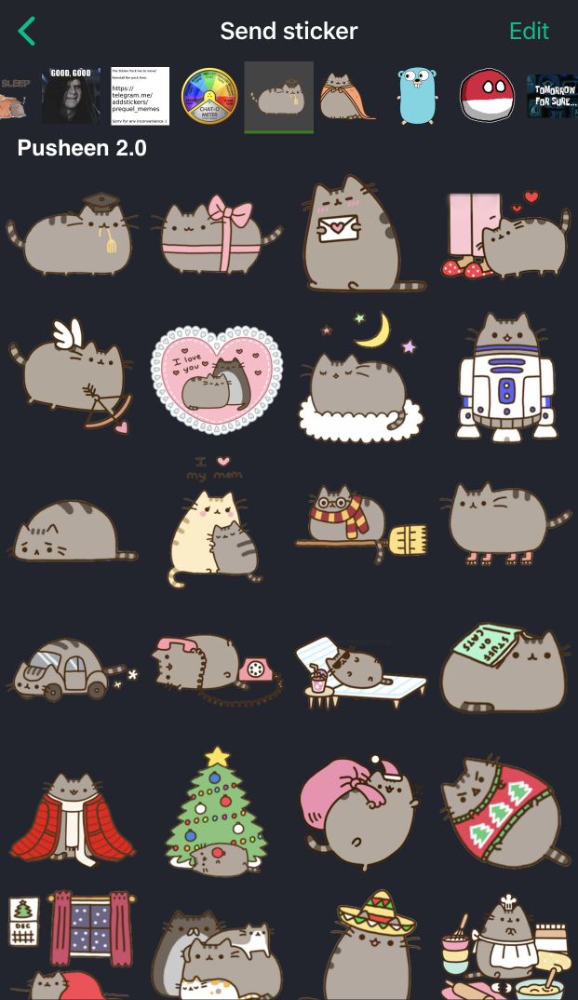

# Maunium sticker picker

A fast and simple Matrix sticker picker widget. Tested on Element Web, Android & iOS.

## Hackerspace How-to

First make sure you have python 3.6 or later installed. Then run the following commands:

```bash
pip install .
```

Now you can put the stickers in a pack in the packs directory. You can either use the hackerspace pack or create your own. Remember to add the number of the sticker in the starts of the file name. It should look liks this `01-name.png`. You can use either png, jpg or gif files.

Then to install the pack run the following command:

```bash
sticker-pack <pack directory> --add-to-index web/packs/
```

When you push the repo the pack will be deployed to be used by the Hackerspace Matrix.

## Discussion

Matrix room: [`#stickerpicker:maunium.net`](https://matrix.to/#/#stickerpicker:maunium.net)

## Instructions

For setup and usage instructions, please visit the [wiki](https://github.com/maunium/stickerpicker/wiki):

* [Creating packs](https://github.com/maunium/stickerpicker/wiki/Creating-packs)
* [Enabling the widget](https://github.com/maunium/stickerpicker/wiki/Enabling-the-widget)
* [Hosting on GitHub pages](https://github.com/maunium/stickerpicker/wiki/Hosting-on-GitHub-pages)

If you prefer video tutorials, [Brodie Robertson](https://www.youtube.com/c/BrodieRobertson) has made a great video on setting up the picker and creating some packs: <https://youtu.be/Yz3H6KJTEI0>.

## Comparison with other sticker pickers

* Scalar is the default integration manager in Element, which can't be self-hosted and only supports predefined sticker packs.
* [Dimension](https://github.com/turt2live/matrix-dimension) is an alternate integration manager. It can be self-hosted, but it's more difficult than Maunium sticker picker.
* Maunium sticker picker is just a sticker picker rather than a full integration manager. It's much simpler than integration managers, but currently has to be set up manually per-user.

| Feature                         | Scalar | Dimension | Maunium sticker picker |
|---------------------------------|--------|-----------|------------------------|
| Free software                   | ❌     | ✔️        | ✔️                     |
| Custom sticker packs            | ❌     | ✔️        | ✔️                     |
| Telegram import                 | ❌     | ✔️        | ✔️                     |
| Works on Element mobiles        | ✔️     | ❌        | ✔️                     |
| Easy multi-user setup           | ✔️     | ✔️        | ❌<sup>[#7][#7]</sup>  |
| Frequently used stickers at top | ❌     | ❌        | ✔️                     |

[#7]: https://github.com/maunium/stickerpicker/issues/7

## Preview

### Element Web



### Element Android


### Element iOS (dark theme)


