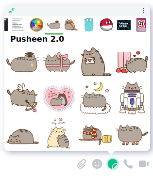
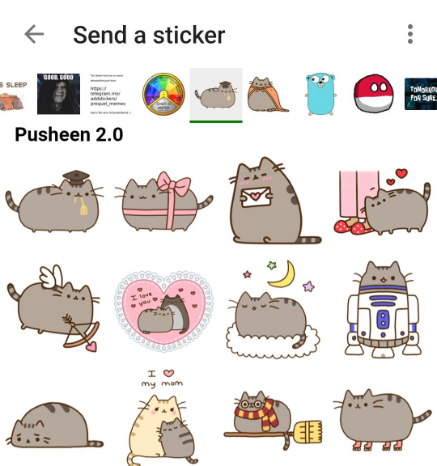
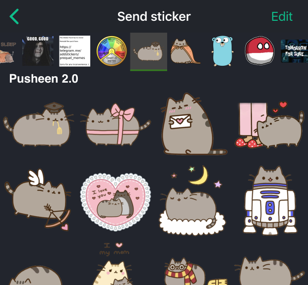

# No longer maintained
[MSC2545](https://github.com/matrix-org/matrix-spec-proposals/pull/2545) has
been accepted into the Matrix spec and most clients already implemented it long
ago.

Importing packs from Telegram is built into the Telegram bridge now, just use
the command, e.g. `!tg import-image-pack https://t.me/addstickers/pusheen02`
(Signal, WhatsApp and Slack also support importing packs). The giphy/klipy proxy
will be maintained as a separate project for gomuks at <https://github.com/gomuks/gifproxy>.

The wiki also has a command to convert existing packs to the MSC2545 format:
<https://github.com/maunium/stickerpicker/wiki/Creating-packs#converting-packs-to-msc2545-format>.

This project still works fine for users who are stuck on Element, but it's
better to use clients that support native Matrix sticker packs.

# Maunium sticker picker

A fast and simple Matrix sticker picker widget. Tested on Element Web, Android & iOS.

## Discussion

Matrix room: [`#stickerpicker:maunium.net`](https://matrix.to/#/#stickerpicker:maunium.net)

## Instructions

For setup and usage instructions, please visit the [wiki](https://github.com/maunium/stickerpicker/wiki):

- [Creating packs](https://github.com/maunium/stickerpicker/wiki/Creating-packs)
- [Enabling the widget](https://github.com/maunium/stickerpicker/wiki/Enabling-the-widget)
- [Hosting on GitHub pages](https://github.com/maunium/stickerpicker/wiki/Hosting-on-GitHub-pages)

If you prefer video tutorials, [Brodie Robertson](https://www.youtube.com/c/BrodieRobertson) has made a great video on setting up the picker and creating some packs: https://youtu.be/Yz3H6KJTEI0.

## Comparison with other sticker pickers

- Scalar is the default integration manager in Element, which can't be self-hosted and only supports predefined sticker packs.
- [Dimension](https://github.com/turt2live/matrix-dimension) is an alternate integration manager. It can be self-hosted, but it's more difficult than Maunium sticker picker.
- Maunium sticker picker is just a sticker picker rather than a full integration manager. It's much simpler than integration managers, but currently has to be set up manually per-user.

| Feature                         | Scalar | Dimension | Maunium sticker picker |
| ------------------------------- | ------ | --------- | ---------------------- |
| Free software                   | ❌     | ✔️        | ✔️                     |
| Custom sticker packs            | ❌     | ✔️        | ✔️                     |
| Telegram import                 | ❌     | ✔️        | ✔️                     |
| Works on Element mobiles        | ✔️     | ❌        | ✔️                     |
| Easy multi-user setup           | ✔️     | ✔️        | ❌[#7][#7]  |
| Frequently used stickers at top | ❌     | ❌        | ✔️                     |

[#7]: https://github.com/maunium/stickerpicker/issues/7

## Preview

| Web / Desktop                                  | Android                                                | iOS (Dark theme)                               |
| ---------------------------------------------- | ------------------------------------------------------ | ---------------------------------------------- |
|  |  |  |

## Additional configuration

On an hosted instance of the sticker picker, it is possible to provide optional URL params for extended configuration :

- `?config=<link to an index.json file>`
  - allows to use an external `index.json` file (see [packs/README.md](packs/README.md))
  - this overrides the `web/packs/index.json` file
- `?theme=[$theme|default|light|black|dark]`
  - provides the theme to use for the sticker picker
  - `$theme` matches the theme of your Element client
